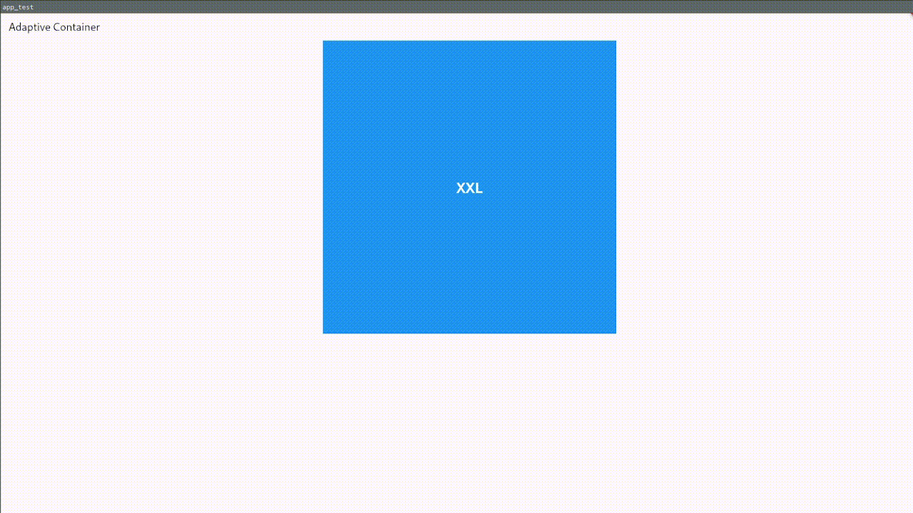
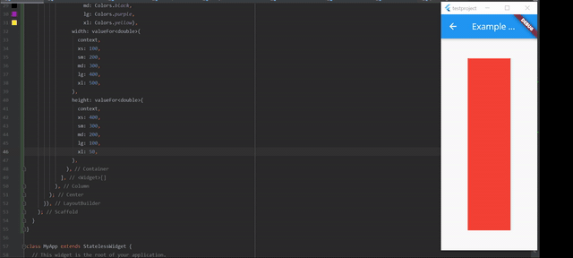

Apply values per media breakpoints. Breakpoints are similar to the breakpoints used in 
bootstrap css framework.
https://getbootstrap.com/docs/4.1/layout/overview/#responsive-breakpoints

# Adaptive Container
Conditionally layout per screen size

### example


 ```dart

  AdaptiveContainer(
    configs: {
      BreakPoint.xs: AdaptiveSlot(builder: (context) {
        return Container(
          width: 100,
          height: 100,
          color: Colors.red,
          child: const Center(
              child: Text(
                  style: TextStyle(
                      fontSize: 30,
                      color: Colors.white,
                      fontWeight: FontWeight.bold),
                  'XS'),
          ),
        );
      }),
       BreakPoint.md: AdaptiveSlot(builder: (context) {
        return Container(
          width: 100,
          height: 100,
          color: Colors.green,
          child: const Center(
              child: Text(
                  style: TextStyle(
                      fontSize: 30,
                      color: Colors.white,
                      fontWeight: FontWeight.bold),
                  'MD'),
          ),
        );
      }),
  })
```


# Breakpoints

Conditionally set values per screen size

### example


```dart
Container c = Container(
    padding: valueFor<EdgeInsetGeometry>(
    context,
    xs:EdgeInsets.only(left: 25, right: 20),
    md:EdgeInsets.only(left: 25, right: 20),
    lg:EdgeInsets.only(left: 25, right: 20),
    )
);
```

```dart
double num = valueFor<double>(
  context, 
  xs:1,
  sm:2,
  md:3,
  lg:4,
  xl:4,
);
 ```
