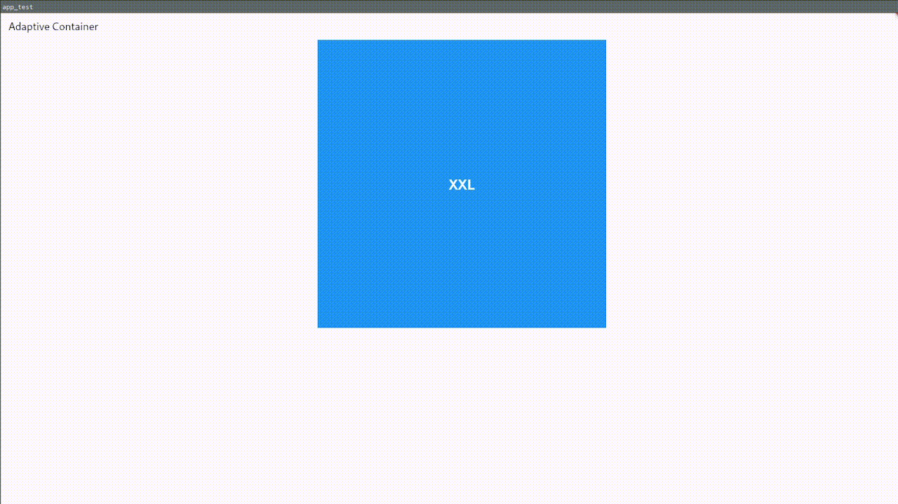

# Flutter Media Break Points

A responsive design toolkit for Flutter apps. It supports familiar width
breakpoints (`xs` to `xxl`), semantic layout sizes (`compact`, `medium`,
`expanded`), container-aware layouts, adaptive navigation, and responsive
grids.

[Bootstrap Breakpoints Reference](https://getbootstrap.com/docs/4.1/layout/overview/#responsive-breakpoints)



## Installation

Add this to `pubspec.yaml`:

```yaml
media_break_points: ^1.7.0
```

Import it:

```dart
import 'package:media_break_points/media_break_points.dart';
```

## Quickstart

Initialize the package once if you want custom breakpoints or orientation-aware
resolution:

```dart
void main() {
  initMediaBreakPoints(
    const MediaBreakPointsConfig(
      considerOrientation: true,
    ),
  );
  runApp(const MyApp());
}
```

## Feature Taxonomy

The package is organized around a small core. Start with these categories
first:

- Core engine: breakpoint data, responsive values, fluid interpolation,
  container queries, animated layout builders, visibility, and debugging.
- Core primitives: reusable spatial behaviors such as panes, sections,
  inspectors, action bars, forms, clusters, and responsive grids.
- Core shells and surfaces: the small set of higher-level layouts that form the
  main package story, such as `AdaptiveScaffold`, `AdaptiveWorkspaceShell`,
  `AdaptiveDataView`, `AdaptiveFilterLayout`, `AdaptiveResultBrowser`,
  `AdaptiveDocumentView`, and `AdaptiveDiffView`.
- Showcase patterns: product-shaped compositions built from the core APIs.
  They stay available and documented, but they are examples of composition, not
  the canonical starting point for the package.

If you are adopting the library, prefer the core engine, primitives, and
surfaces first. The `Showcase:` sections further down the README are meant to
demonstrate how those building blocks can be combined.

The core package lives in:

```dart
import 'package:media_break_points/media_break_points.dart';
```

Showcase patterns now live in a separate library:

```dart
import 'package:media_break_points/patterns.dart';
```

## Core Feature Guides

## Responsive Values

Use `valueFor` when you want the original exact-match breakpoint behavior:

```dart
final padding = valueFor<EdgeInsets>(
  context,
  xs: const EdgeInsets.all(12),
  md: const EdgeInsets.all(20),
  defaultValue: const EdgeInsets.all(16),
);
```

Use `ResponsiveValue` or `context.responsive` when you want cascading fallback
and semantic sizes:

```dart
final gap = context.responsive<double>(
  compact: 12,
  medium: 20,
  expanded: 28,
);

final cardPadding = const ResponsiveValue<EdgeInsets>(
  md: EdgeInsets.all(20),
  expanded: EdgeInsets.all(28),
).resolve(context);
```

Use `FluidResponsiveValue` or `context.fluidResponsive` when you want values to
interpolate between anchors instead of jumping at breakpoints:

```dart
final fontSize = context.fluidResponsive<double>(
  lerp: (a, b, t) => lerpDouble(a, b, t) ?? a,
  sm: 16,
  md: 20,
  xl: 28,
);
```

## Breakpoint Data

`BreakPointData` gives you the resolved width, height, orientation, raw
breakpoint, and semantic size class in one object:

```dart
final data = context.breakPointData;

Text('Breakpoint: ${data.breakPoint.label}');
Text('Layout class: ${data.adaptiveSize.name}');
```

`BreakPointData` also includes a semantic height class:

```dart
final data = context.breakPointData;

Text('Height class: ${data.adaptiveHeight.name}');
```

Semantic sizes map like this:

- `xs`, `sm` -> `AdaptiveSize.compact`
- `md` -> `AdaptiveSize.medium`
- `lg`, `xl`, `xxl` -> `AdaptiveSize.expanded`

Height classes map like this:

- `< 560` -> `AdaptiveHeight.compact`
- `560 - 799` -> `AdaptiveHeight.medium`
- `>= 800` -> `AdaptiveHeight.expanded`

## Height-aware Rules

`ResponsiveValue` can now fall back to semantic height classes when width-based
rules are not provided:

```dart
final detail = context.responsive<String>(
  heightCompact: 'Prioritize primary actions.',
  heightExpanded: 'Show richer supporting context.',
);
```

Width-specific and semantic width rules still resolve first. Height rules are
best used when the same width needs different density based on available
vertical space.

## Container-Aware Layouts

Use `ResponsiveContainerBuilder` when a widget should adapt to its own width
instead of the full screen width:

```dart
ResponsiveContainerBuilder(
  builder: (context, data) {
    return data.isCompact
        ? const Column(children: [Text('Stacked')])
        : const Row(children: [Text('Split')]);
  },
)
```

You can also make `ResponsiveLayoutBuilder` use parent constraints:

```dart
ResponsiveLayoutBuilder(
  useContainerConstraints: true,
  xs: (context, _) => const MobilePane(),
  md: (context, _) => const TabletPane(),
  lg: (context, _) => const DesktopPane(),
)
```

Use `AnimatedResponsiveLayoutBuilder` when the layout should transition smoothly
as the active breakpoint changes:

```dart
AnimatedResponsiveLayoutBuilder(
  duration: const Duration(milliseconds: 250),
  useContainerConstraints: true,
  xs: (context, _) => const CompactPane(),
  md: (context, _) => const SplitPane(),
)
```

## Adaptive Containers

`AdaptiveContainer` gives you a slot-based alternative to the builder APIs.
It can resolve exact breakpoints, semantic sizes, and parent constraints:

```dart
AdaptiveContainer(
  enableAnimation: true,
  animationDuration: 250,
  animateOnAdaptiveSize: true,
  compact: const AdaptiveSlot(
    builder: _buildCompactLayout,
  ),
  medium: const AdaptiveSlot(
    builder: _buildMediumLayout,
  ),
  expanded: const AdaptiveSlot(
    builder: _buildExpandedLayout,
  ),
)
```

Use `useContainerConstraints: true` when a nested panel should switch from its
own width instead of the full screen.

## Adaptive Clusters

`AdaptiveCluster` lets one child list switch between stacked, wrapped, and
inline arrangements:

```dart
AdaptiveCluster(
  compactLayout: AdaptiveClusterLayout.column,
  mediumLayout: AdaptiveClusterLayout.wrap,
  expandedLayout: AdaptiveClusterLayout.row,
  children: const [
    _ClusterCard(title: 'Ship faster'),
    _ClusterCard(title: 'Stay flexible'),
    _ClusterCard(title: 'Scale cleanly'),
  ],
)
```

This works well for feature cards, KPI strips, tool groups, and nested control
clusters where a full grid would be too rigid.

## Adaptive Panes

`AdaptivePane` gives you a reusable split-view primitive. It stacks on compact
containers and switches to a split pane from `AdaptiveSize.medium` by default:

```dart
AdaptivePane(
  primary: const ConversationList(),
  secondary: const ConversationDetails(),
)
```

You can keep it screen-based with `useContainerConstraints: false`, or change
the split threshold with `splitAt`. Use `minimumSplitHeight` when short-but-wide
surfaces should stay stacked instead of splitting.

## Adaptive Action Bars

`AdaptiveActionBar` keeps high-priority actions inline and moves the rest into
an overflow menu when space becomes tight:

```dart
AdaptiveActionBar(
  actions: const [
    AdaptiveActionBarAction(
      icon: Icon(Icons.add),
      label: 'Create',
      priority: 3,
      variant: AdaptiveActionVariant.filled,
      pinToPrimaryRow: true,
    ),
    AdaptiveActionBarAction(
      icon: Icon(Icons.share_outlined),
      label: 'Share',
      priority: 2,
    ),
    AdaptiveActionBarAction(
      icon: Icon(Icons.archive_outlined),
      label: 'Archive',
      priority: 0,
      variant: AdaptiveActionVariant.text,
    ),
  ],
)
```

Use `priority` to decide which actions stay visible longer, and
`pinToPrimaryRow` for actions that should remain inline whenever possible.

## Adaptive Forms

`AdaptiveForm` groups form fields into reusable sections. Compact containers
render those sections in a stepper, while medium and expanded containers lay
them out as cards:

```dart
AdaptiveForm(
  sections: const [
    AdaptiveFormSection(
      title: 'Workspace',
      description: 'Naming, routing, and owner defaults.',
      leading: Icon(Icons.tune_outlined),
      children: [
        _SettingField(label: 'Workspace name'),
        _SettingField(label: 'Primary region'),
      ],
    ),
    AdaptiveFormSection(
      title: 'Notifications',
      description: 'Where review activity should be sent.',
      leading: Icon(Icons.notifications_outlined),
      children: [
        _SettingField(label: 'Release channel'),
        _SettingField(label: 'Escalation contact'),
      ],
    ),
  ],
)
```

Use `sectionedAt` to change when grouped cards take over, or
`useContainerConstraints: false` to resolve the form from the full screen width.

## Priority Layouts

`AdaptivePriorityLayout` keeps primary content visible and collapses
supporting content into an expandable card on compact containers:

```dart
AdaptivePriorityLayout(
  supportingTitle: 'Workspace summary',
  supportingDescription: 'Pinned modules and review counts.',
  supportingLeading: const Icon(Icons.insights_outlined),
  minimumSplitHeight: AdaptiveHeight.medium,
  primary: const WorkspaceCanvas(),
  supporting: const WorkspaceSummary(),
)
```

From `AdaptiveSize.medium` by default, the supporting surface docks beside the
primary content instead of collapsing below it. Use `minimumSplitHeight` when
short wide surfaces should keep the supporting region collapsed.

## Adaptive Inspectors

`AdaptiveInspectorLayout` is useful when a sidebar should stay docked on larger
surfaces but become a modal inspector on compact widths:

```dart
AdaptiveInspectorLayout(
  inspectorTitle: 'Layout inspector',
  inspectorDescription: 'Tune density and compare responsive states.',
  inspectorLeading: const Icon(Icons.tune_outlined),
  minimumDockedHeight: AdaptiveHeight.medium,
  primary: const EditorCanvas(),
  inspector: const InspectorPanel(),
)
```

Use `dockedAt` to control when the inspector becomes inline, or
`minimumDockedHeight` to keep wide-but-short layouts modal. Use
`useContainerConstraints: true` to make nested inspectors resolve from their
parent width instead of the full screen.

## Adaptive Workspace Shells

`AdaptiveWorkspaceShell` packages navigation, action overflow, and inspector
behavior into one higher-level workspace primitive:

```dart
AdaptiveWorkspaceShell(
  title: 'Workspace overview',
  description: 'Coordinate shell chrome without rebuilding every screen.',
  appBarTitle: 'Adaptive Workspace Shell',
  destinations: const [
    AdaptiveScaffoldDestination(
      icon: Icon(Icons.space_dashboard_outlined),
      selectedIcon: Icon(Icons.space_dashboard),
      label: 'Overview',
    ),
    AdaptiveScaffoldDestination(
      icon: Icon(Icons.fact_check_outlined),
      selectedIcon: Icon(Icons.fact_check),
      label: 'Review',
    ),
  ],
  selectedIndex: selectedIndex,
  onSelectedIndexChanged: (index) => setState(() => selectedIndex = index),
  actions: const [
    AdaptiveActionBarAction(
      icon: Icon(Icons.add),
      label: 'Create flow',
      priority: 4,
      variant: AdaptiveActionVariant.filled,
      pinToPrimaryRow: true,
    ),
    AdaptiveActionBarAction(
      icon: Icon(Icons.ios_share_outlined),
      label: 'Share',
      priority: 3,
      variant: AdaptiveActionVariant.tonal,
    ),
  ],
  inspectorTitle: 'Workspace inspector',
  inspectorDescription: 'Track adaptive state and pinned modules.',
  minimumRailHeight: AdaptiveHeight.medium,
  minimumDrawerHeight: AdaptiveHeight.medium,
  minimumInspectorDockedHeight: AdaptiveHeight.medium,
  content: const WorkspaceCanvas(),
  inspector: const InspectorPanel(),
)
```

Use `AdaptiveWorkspaceShell` when several screens share the same navigation,
top-level actions, and supporting inspector behavior. The inner `content` still
stays free to compose grids, panes, forms, and container-aware layouts.

## Adaptive Sections

`AdaptiveSections` is useful for settings, preferences, and workspace subpages
that should keep related sections on one screen:

```dart
AdaptiveSections(
  minimumSidebarHeight: AdaptiveHeight.medium,
  navigationHeader: const Text('Workspace areas'),
  sections: const [
    AdaptiveSection(
      label: 'Profile',
      icon: Icon(Icons.person_outline),
      description: 'Identity and ownership settings.',
      child: ProfileSection(),
    ),
    AdaptiveSection(
      label: 'Notifications',
      icon: Icon(Icons.notifications_outlined),
      description: 'Delivery rules and digest cadence.',
      child: NotificationSection(),
    ),
    AdaptiveSection(
      label: 'Appearance',
      icon: Icon(Icons.palette_outlined),
      description: 'Theme, density, and preview defaults.',
      child: AppearanceSection(),
    ),
  ],
)
```

Compact containers render a horizontal chip row above the active section.
Medium and expanded containers render a docked sidebar. Use
`minimumSidebarHeight` when wide-but-short surfaces should stay in compact mode,
and `useContainerConstraints: true` when nested cards should resolve from their
own width instead of the full screen.

## Adaptive Data Views

`AdaptiveDataView` helps data-heavy screens move from stacked record cards into
tables without maintaining two unrelated UIs:

```dart
AdaptiveDataView<WorkspaceRecord>(
  records: records,
  minimumTableHeight: AdaptiveHeight.medium,
  compactTitleBuilder: (context, record) => Text(record.name),
  compactSubtitleBuilder: (context, record) => Text(record.team),
  compactTrailingBuilder: (context, record) =>
      StatusBadge(status: record.status),
  columns: [
    AdaptiveDataColumn(
      label: 'Owner',
      cellBuilder: (context, record) => Text(record.name),
    ),
    AdaptiveDataColumn(
      label: 'Team',
      cellBuilder: (context, record) => Text(record.team),
    ),
    AdaptiveDataColumn(
      label: 'Status',
      cellBuilder: (context, record) => StatusBadge(status: record.status),
    ),
    AdaptiveDataColumn(
      label: 'Throughput',
      numeric: true,
      cellBuilder: (context, record) => Text('${record.throughput}'),
    ),
  ],
)
```

Compact containers render cards. Medium and expanded containers render a
scrollable `DataTable`. Use `minimumTableHeight` when wide-but-short layouts
should stay in card mode, and `useContainerConstraints: true` when nested
panels should resolve from their own width.

## Showcase Pattern Guides

Import `package:media_break_points/patterns.dart` alongside the core library
when you want the higher-level example patterns below.

## Showcase: Adaptive Boards

`AdaptiveBoard` helps workflow and kanban-style screens keep one lane model
that can stack vertically or spread into board columns:

```dart
AdaptiveBoard(
  minimumBoardHeight: AdaptiveHeight.medium,
  lanes: const [
    AdaptiveBoardLane(
      title: 'Queued',
      description: 'Ready for the next adaptive pass.',
      items: [
        TaskCard(title: 'Refine dashboard density'),
        TaskCard(title: 'Audit nested forms'),
      ],
      footer: LaneActionButton(label: 'Create task'),
    ),
    AdaptiveBoardLane(
      title: 'Building',
      description: 'In active implementation.',
      items: [
        TaskCard(title: 'Workspace shell follow-up'),
      ],
    ),
  ],
)
```

Compact containers render vertically stacked lanes. Medium and expanded
containers render horizontally scrollable columns. Use `minimumBoardHeight`
when wide-but-short layouts should stay stacked, and `useContainerConstraints:
true` when nested cards or panes should resolve from their own width.

## Showcase: Adaptive Timelines

`AdaptiveTimeline` helps roadmap and milestone screens move between stacked
milestone cards and a horizontal timeline without keeping two separate views:

```dart
AdaptiveTimeline(
  minimumHorizontalHeight: AdaptiveHeight.medium,
  entries: const [
    AdaptiveTimelineEntry(
      title: 'Prototype the adaptive core',
      label: 'Q1',
      description: 'Validate semantic breakpoints and fluid values.',
      leading: Icon(Icons.flag_outlined),
      trailing: StageBadge(label: 'Foundation'),
      child: MilestoneCard(title: 'Key result'),
    ),
    AdaptiveTimelineEntry(
      title: 'Systemize workflow surfaces',
      label: 'Q2',
      description: 'Bring navigation, inspectors, and sections together.',
      leading: Icon(Icons.auto_awesome_outlined),
    ),
  ],
)
```

Compact containers render vertically stacked milestones. Medium and expanded
containers render a horizontally scrollable timeline. Use
`minimumHorizontalHeight` when wide-but-short layouts should stay stacked, and
`useContainerConstraints: true` when nested cards should resolve from their own
width instead of the full screen.

## Showcase: Adaptive Comparisons

`AdaptiveComparison` is useful for pricing tiers, rollout plans, and variant
decisions where compact layouts should focus on one option at a time:

```dart
AdaptiveComparison(
  minimumColumnsHeight: AdaptiveHeight.medium,
  items: const [
    AdaptiveComparisonItem(
      label: 'Starter',
      description: 'Lean adaptive defaults for smaller teams.',
      leading: Icon(Icons.eco_outlined),
      trailing: PriceBadge(label: '\$29'),
      child: ComparisonBody(title: 'Best for early rollout'),
    ),
    AdaptiveComparisonItem(
      label: 'Growth',
      description: 'More workflow surfaces and inspector behavior.',
      leading: Icon(Icons.trending_up_outlined),
      trailing: PriceBadge(label: '\$79'),
      child: ComparisonBody(title: 'Best for active teams'),
    ),
  ],
)
```

Compact containers render a segmented selector and one active option. Medium and
expanded containers render all options side by side. Use
`minimumColumnsHeight` when wide-but-short layouts should stay in compact mode,
and `useContainerConstraints: true` when nested cards should resolve from their
own width.

## Adaptive Diff Views

`AdaptiveDiffView` helps review and approval screens move between a compact
toggle and a side-by-side diff:

```dart
AdaptiveDiffView(
  minimumSplitHeight: AdaptiveHeight.medium,
  primary: const AdaptiveDiffPane(
    label: 'Current',
    description: 'The shipped workspace shell.',
    child: ReviewPaneBody(title: 'What is already working'),
  ),
  secondary: const AdaptiveDiffPane(
    label: 'Proposed',
    description: 'The next review pass.',
    child: ReviewPaneBody(title: 'What changes in this pass'),
  ),
)
```

Compact containers show one selected pane at a time behind a segmented toggle.
Medium and expanded containers show both panes side by side. Use
`minimumSplitHeight` when wide-but-short layouts should stay in toggle mode,
and `useContainerConstraints: true` when nested review surfaces should resolve
from their own width.

## Showcase: Adaptive Schedules

`AdaptiveSchedule` helps planning and agenda screens switch between a stacked
day list and side-by-side day columns:

```dart
AdaptiveSchedule(
  minimumColumnsHeight: AdaptiveHeight.medium,
  days: const [
    AdaptiveScheduleDay(
      label: 'Monday',
      description: 'Prototype and review',
      entries: [
        AdaptiveScheduleEntry(
          timeLabel: '09:00',
          title: 'Design review',
          description: 'Walk through the adaptive shell catalog.',
        ),
        AdaptiveScheduleEntry(
          timeLabel: '13:30',
          title: 'Spacing audit',
        ),
      ],
    ),
    AdaptiveScheduleDay(
      label: 'Tuesday',
      description: 'Implementation',
      entries: [
        AdaptiveScheduleEntry(
          timeLabel: '10:00',
          title: 'Board refinement',
        ),
      ],
    ),
  ],
)
```

Compact containers render a stacked agenda by day. Medium and expanded
containers render side-by-side day columns. Use `minimumColumnsHeight` when
wide-but-short layouts should stay in agenda mode, and
`useContainerConstraints: true` when nested cards should resolve from their own
width.

## Showcase: Adaptive Calendars

`AdaptiveCalendar` helps week and sprint views move between a stacked agenda and
a multi-column day grid:

```dart
AdaptiveCalendar(
  minimumGridHeight: AdaptiveHeight.medium,
  days: const [
    AdaptiveCalendarDay(
      label: 'Mon 1',
      subtitle: 'Sprint kickoff',
      entries: [
        EventChip(label: 'Standup'),
        EventChip(label: 'Design review'),
      ],
    ),
    AdaptiveCalendarDay(
      label: 'Tue 2',
      subtitle: 'Build day',
      entries: [
        EventChip(label: 'Implementation'),
      ],
    ),
  ],
)
```

Compact containers render a stacked day agenda. Medium and expanded containers
render a multi-column grid of day cards. Use `minimumGridHeight` when
wide-but-short layouts should stay in agenda mode, and
`useContainerConstraints: true` when nested cards should resolve from their own
width.

## Showcase: Adaptive Decks

`AdaptiveDeck` helps overview and launch surfaces move between a focused card
pager and a responsive deck grid:

```dart
AdaptiveDeck(
  minimumGridHeight: AdaptiveHeight.medium,
  items: const [
    AdaptiveDeckItem(
      label: 'Foundation',
      description: 'Core responsive primitives.',
      leading: Icon(Icons.layers_outlined),
      child: DeckBody(title: 'What ships here'),
    ),
    AdaptiveDeckItem(
      label: 'Workflow',
      description: 'Compound workspace surfaces.',
      leading: Icon(Icons.workspaces_outline),
      child: DeckBody(title: 'What ships here'),
    ),
  ],
)
```

Compact containers render a paged card deck. Medium and expanded containers
render a responsive card grid. Use `minimumGridHeight` when wide-but-short
layouts should stay in pager mode, and `useContainerConstraints: true` when
nested cards should resolve from their own width.

## Showcase: Adaptive Galleries

`AdaptiveGallery` helps preview-heavy screens move between a compact carousel
and a wider spotlight view with a selector list:

```dart
AdaptiveGallery(
  minimumSpotlightHeight: AdaptiveHeight.medium,
  items: const [
    AdaptiveGalleryItem(
      label: 'Workspace launch',
      description: 'Preview the shell and nested inspector surfaces.',
      leading: Icon(Icons.web_asset_outlined),
      preview: PreviewSurface(title: 'One shell, many surfaces.'),
      child: GalleryBody(title: 'What to inspect'),
    ),
    AdaptiveGalleryItem(
      label: 'Review queue',
      description: 'Preview denser card stacks for active reviews.',
      leading: Icon(Icons.fact_check_outlined),
      preview: PreviewSurface(title: 'Review states stay scannable.'),
      child: GalleryBody(title: 'What to inspect'),
    ),
  ],
)
```

Compact containers render a paged preview carousel. Medium and expanded
containers render a selected spotlight card with a selector list. Use
`minimumSpotlightHeight` when wide-but-short layouts should stay in carousel
mode, and `useContainerConstraints: true` when nested cards should resolve from
their own width.

## Adaptive Filter Layouts

`AdaptiveFilterLayout` helps search-and-browse screens keep results visible on
compact layouts while docking filters inline on larger surfaces:

```dart
AdaptiveFilterLayout(
  filtersTitle: 'Filter library',
  filtersDescription: 'Tune component type, density, and release status.',
  activeFilters: const [
    Chip(label: Text('Mobile-ready')),
    Chip(label: Text('Live')),
    Chip(label: Text('Navigation')),
  ],
  resultsHeader: const FilterResultsHeader(
    title: '89 matching components',
  ),
  results: const ResultsList(),
  filters: const FilterControls(),
  minimumDockedHeight: AdaptiveHeight.medium,
)
```

Compact containers keep the results primary, show active filters above the
results, and move the filter controls into a modal sheet. Medium and expanded
containers dock the filter surface inline. Use `minimumDockedHeight` when
wide-but-short layouts should stay in modal mode, and
`useContainerConstraints: true` when nested browsing surfaces should resolve
from their own width.

## Adaptive Result Browsers

`AdaptiveResultBrowser` helps search and asset flows keep the result list
primary on compact layouts while docking details inline on larger surfaces:

```dart
AdaptiveResultBrowser<SearchResult>(
  results: results,
  header: const SearchResultsHeader(
    title: 'Component search results',
  ),
  minimumSplitHeight: AdaptiveHeight.medium,
  itemBuilder: (context, result, selected, onTap) {
    return SearchResultTile(
      result: result,
      selected: selected,
      onTap: onTap,
    );
  },
  detailBuilder: (context, result) {
    return SearchResultDetail(result: result);
  },
)
```

Compact containers keep the result list primary and open details in a modal
sheet when a result is tapped. Medium and expanded containers dock the list and
detail view side by side. Use `minimumSplitHeight` when wide-but-short layouts
should stay modal-first, and `useContainerConstraints: true` when nested result
surfaces should resolve from their own width.

## Showcase: Adaptive Explorers

`AdaptiveExplorer` helps library and search workspaces combine filters, results,
and details into one adaptive surface:

```dart
AdaptiveExplorer<SearchResult>(
  results: results,
  filtersTitle: 'Explorer filters',
  filtersDescription: 'Focus the component library by status and type.',
  activeFilters: const [
    Chip(label: Text('Live')),
    Chip(label: Text('Navigation')),
  ],
  header: const SearchResultsHeader(
    title: 'Component explorer',
  ),
  filters: const FilterControls(),
  itemBuilder: (context, result, selected, onTap) {
    return SearchResultTile(
      result: result,
      selected: selected,
      onTap: onTap,
    );
  },
  detailBuilder: (context, result) {
    return SearchResultDetail(result: result);
  },
)
```

Compact containers keep filters and details modal-first so the result list stays
primary. Larger containers dock filters, results, and detail side by side in a
single explorer workspace. Use `minimumDockedHeight` when short-but-wide
surfaces should stay modal-first, and `useContainerConstraints: true` when
nested explorers should resolve from their own width.

## Adaptive Document Views

`AdaptiveDocumentView` helps specs, release notes, and guidelines keep the
document itself primary on compact layouts while docking a section outline
inline on larger surfaces:

```dart
AdaptiveDocumentView(
  header: const DocumentHeader(
    title: 'Adaptive package release notes',
  ),
  outlineTitle: 'Release outline',
  outlineDescription: 'Jump between the major changes in this pass.',
  minimumDockedHeight: AdaptiveHeight.medium,
  sections: const [
    AdaptiveDocumentSection(
      label: 'Overview',
      summary: 'Why this release matters.',
      leading: Icon(Icons.description_outlined),
      child: DocumentSectionBody(title: 'What changed'),
    ),
    AdaptiveDocumentSection(
      label: 'Layout rules',
      summary: 'Width and height decisions used by the new primitives.',
      leading: Icon(Icons.rule_outlined),
      child: DocumentSectionBody(title: 'How sizing works'),
    ),
  ],
)
```

Compact containers keep reading flow primary and open the outline from a modal
bottom sheet. Medium and expanded containers dock the outline beside the
document. Use `minimumDockedHeight` when wide-but-short layouts should stay
modal-first, and `useContainerConstraints: true` when nested document surfaces
should resolve from their own width.

## Showcase: Adaptive Workbenches

`AdaptiveWorkbench` helps builder, studio, and configuration screens stage a
library, a canvas, and an inspector from one adaptive surface:

```dart
AdaptiveWorkbench(
  header: const WorkbenchHeader(
    title: 'Adaptive studio',
  ),
  libraryTitle: 'Asset library',
  libraryDescription: 'Choose sections, cards, and workflow surfaces.',
  library: const AssetLibraryPanel(),
  inspectorTitle: 'Selection inspector',
  inspectorDescription: 'Tune spacing, emphasis, and release state.',
  inspector: const InspectorControls(),
  canvas: const StudioCanvas(),
)
```

Compact containers keep the canvas primary and move both side panels into modal
sheets. Medium containers dock the library first, then expanded containers dock
the inspector too. Use `minimumInspectorDockedHeight` when short-but-wide
surfaces should keep the inspector modal, and `useContainerConstraints: true`
when nested studio surfaces should resolve from their own width.

## Showcase: Adaptive Review Desks

`AdaptiveReviewDesk` helps moderation, QA, and approval flows stage a queue, a
central review surface, and a decision panel from one adaptive workspace:

```dart
AdaptiveReviewDesk<ReviewItem>(
  queueTitle: 'Review queue',
  decisionTitle: 'Decision panel',
  header: const ReviewHeader(
    title: 'Workspace shell review',
  ),
  items: items,
  itemBuilder: (context, item, selected, onTap) {
    return ReviewQueueTile(
      item: item,
      selected: selected,
      onTap: onTap,
    );
  },
  reviewBuilder: (context, item) => ReviewSurface(item: item),
  decisionBuilder: (context, item) => DecisionPanel(item: item),
)
```

Compact containers keep the review surface primary and move both the queue and
decision panel into modal sheets. Medium containers dock the queue first, then
expanded containers dock the decision panel too. Use
`minimumDecisionDockedHeight` when short-but-wide layouts should keep the
decision panel modal, and `useContainerConstraints: true` when nested review
surfaces should resolve from their own width.

## Showcase: Adaptive Conversation Desks

`AdaptiveConversationDesk` helps messaging, support, and collaboration screens
stage a conversation list, an active thread, and a participant/context panel:

```dart
AdaptiveConversationDesk<Conversation>(
  listTitle: 'Conversations',
  contextTitle: 'Participant context',
  header: const ThreadHeader(
    title: 'Adaptive support inbox',
  ),
  conversations: conversations,
  itemBuilder: (context, conversation, selected, onTap) {
    return ConversationTile(
      conversation: conversation,
      selected: selected,
      onTap: onTap,
    );
  },
  threadBuilder: (context, conversation) => ThreadView(conversation: conversation),
  contextBuilder: (context, conversation) =>
      ParticipantContext(conversation: conversation),
)
```

Compact containers keep the active thread primary and move both the list and
the context panel into modal sheets. Medium containers dock the list first,
then expanded containers dock the context panel too. Use
`minimumContextDockedHeight` when short-but-wide layouts should keep the
context panel modal, and `useContainerConstraints: true` when nested messaging
surfaces should resolve from their own width.

## Showcase: Adaptive Composers

`AdaptiveComposer` helps writing, content, and builder flows move between a
compact editor/preview toggle, a split editor-preview layout, and a fully
docked editor-preview plus settings surface:

```dart
AdaptiveComposer(
  header: const ComposerHeader(
    title: 'Adaptive release note composer',
  ),
  editorTitle: 'Editor',
  previewTitle: 'Preview',
  settingsTitle: 'Settings',
  editor: const EditorSurface(),
  preview: const PreviewSurface(),
  settings: const ComposerSettings(),
)
```

Compact containers keep one surface visible at a time behind an editor/preview
toggle and move settings into a modal sheet. Medium containers split editor and
preview, then expanded containers dock settings too. Use
`minimumSettingsDockedHeight` when short-but-wide layouts should keep settings
modal, and `useContainerConstraints: true` when nested composer surfaces should
resolve from their own width.

## Showcase: Adaptive Presentation Desks

`AdaptivePresentationDesk` helps deck-building, speaking, and review flows
stage a slide list, a main presentation stage, and speaker notes:

```dart
AdaptivePresentationDesk<Slide>(
  listTitle: 'Slides',
  notesTitle: 'Speaker notes',
  header: const StageHeader(
    title: 'Adaptive launch deck',
  ),
  slides: slides,
  itemBuilder: (context, slide, selected, onTap) {
    return SlideThumbnail(
      slide: slide,
      selected: selected,
      onTap: onTap,
    );
  },
  stageBuilder: (context, slide) => SlideStage(slide: slide),
  notesBuilder: (context, slide) => SpeakerNotes(slide: slide),
)
```

Compact containers keep the active stage primary and move both the slide list
and speaker notes into modal sheets. Medium containers dock the slide list
first, then expanded containers dock the notes surface too. Use
`minimumNotesDockedHeight` when short-but-wide layouts should keep notes modal,
and `useContainerConstraints: true` when nested stage surfaces should resolve
from their own width.

## Showcase: Adaptive Control Centers

`AdaptiveControlCenter` helps dense operations, monitoring, and command
surfaces stage a sidebar, a central dashboard, a right insights panel, and a
bottom activity stream from one adaptive model:

```dart
AdaptiveControlCenter(
  header: const DashboardHeader(
    title: 'Adaptive control center',
  ),
  sidebarTitle: 'Service lanes',
  insightsTitle: 'Incident insights',
  activityTitle: 'Activity stream',
  sidebar: const ServiceSidebar(),
  main: const MonitoringDashboard(),
  insights: const IncidentInsights(),
  activity: const ActivityTimeline(),
)
```

Compact containers keep the main dashboard primary and move all supporting
panels into modal sheets. Medium containers dock the sidebar first, expanded
containers dock the insights panel next, and tall expanded surfaces can dock
the activity stream below the main dashboard. Use
`minimumActivityDockedHeight` when short-but-wide layouts should keep activity
modal, and `useContainerConstraints: true` when nested control surfaces should
resolve from their own width.

## Showcase: Adaptive Incident Desks

`AdaptiveIncidentDesk` helps incident response, moderation, and operational
review flows stage an incident list, an active detail surface, a context
panel, and a timeline panel from one adaptive workspace:

```dart
AdaptiveIncidentDesk<Incident>(
  listTitle: 'Active incidents',
  contextTitle: 'Responder context',
  timelineTitle: 'Incident timeline',
  header: const IncidentHeader(
    title: 'Adaptive incident desk',
  ),
  incidents: incidents,
  itemBuilder: (context, incident, selected, onTap) {
    return IncidentTile(
      incident: incident,
      selected: selected,
      onTap: onTap,
    );
  },
  detailBuilder: (context, incident) => IncidentDetail(incident: incident),
  contextBuilder: (context, incident) => ResponderContext(incident: incident),
  timelineBuilder: (context, incident) => IncidentTimeline(incident: incident),
)
```

Compact containers keep the active incident detail primary and move the list,
context, and timeline into modal sheets. Medium containers dock the incident
list first, expanded containers dock the context panel next, and tall expanded
surfaces can dock the timeline below the active detail surface. Use
`minimumTimelineDockedHeight` when short-but-wide layouts should keep the
timeline modal, and `useContainerConstraints: true` when nested incident
surfaces should resolve from their own width.

## Showcase: Adaptive Metrics Labs

`AdaptiveMetricsLab` helps analytics, reporting, and observability flows stage
a query list, a main focus surface, annotations, and query history from one
adaptive workspace:

```dart
AdaptiveMetricsLab<MetricQuery>(
  queryTitle: 'Saved queries',
  annotationsTitle: 'Annotations',
  historyTitle: 'Query history',
  header: const MetricsHeader(
    title: 'Adaptive metrics lab',
  ),
  queries: queries,
  itemBuilder: (context, query, selected, onTap) {
    return QueryTile(
      query: query,
      selected: selected,
      onTap: onTap,
    );
  },
  focusBuilder: (context, query) => MetricFocus(query: query),
  annotationsBuilder: (context, query) => MetricAnnotations(query: query),
  historyBuilder: (context, query) => QueryHistory(query: query),
)
```

Compact containers keep the active focus surface primary and move the query
list, annotations, and history into modal sheets. Medium containers dock the
query list first, expanded containers dock annotations next, and tall expanded
surfaces can dock history below the active focus surface. Use
`minimumHistoryDockedHeight` when short-but-wide layouts should keep history
modal, and `useContainerConstraints: true` when nested analytics surfaces
should resolve from their own width.

## Showcase: Adaptive Experiment Labs

`AdaptiveExperimentLab` helps experimentation, rollout, and decision-review
flows stage an experiment list, an active focus surface, evidence, and a
decision log from one adaptive workspace:

```dart
AdaptiveExperimentLab<Experiment>(
  experimentTitle: 'Active experiments',
  evidenceTitle: 'Evidence',
  decisionTitle: 'Decision log',
  header: const ExperimentHeader(
    title: 'Adaptive experiment lab',
  ),
  experiments: experiments,
  itemBuilder: (context, experiment, selected, onTap) {
    return ExperimentTile(
      experiment: experiment,
      selected: selected,
      onTap: onTap,
    );
  },
  focusBuilder: (context, experiment) => ExperimentFocus(experiment: experiment),
  evidenceBuilder: (context, experiment) => ExperimentEvidence(experiment: experiment),
  decisionBuilder: (context, experiment) => ExperimentDecisionLog(experiment: experiment),
)
```

Compact containers keep the active experiment focus primary and move the list,
evidence, and decision log into modal sheets. Medium containers dock the
experiment list first, expanded containers dock evidence next, and tall
expanded surfaces can dock the decision log below the active focus surface.
Use `minimumDecisionDockedHeight` when short-but-wide layouts should keep the
decision log modal, and `useContainerConstraints: true` when nested
experimentation surfaces should resolve from their own width.

## Showcase: Adaptive Planning Desks

`AdaptivePlanningDesk` helps planning, roadmap, and coordination flows stage a
plan list, an active plan focus surface, risks, and milestones from one
adaptive workspace:

```dart
AdaptivePlanningDesk<Plan>(
  planTitle: 'Launch plans',
  risksTitle: 'Key risks',
  milestonesTitle: 'Milestones',
  header: const PlanningHeader(
    title: 'Adaptive planning desk',
  ),
  plans: plans,
  itemBuilder: (context, plan, selected, onTap) {
    return PlanTile(
      plan: plan,
      selected: selected,
      onTap: onTap,
    );
  },
  focusBuilder: (context, plan) => PlanFocus(plan: plan),
  risksBuilder: (context, plan) => PlanRisks(plan: plan),
  milestonesBuilder: (context, plan) => PlanMilestones(plan: plan),
)
```

Compact containers keep the active plan focus primary and move the list,
risks, and milestones into modal sheets. Medium containers dock the plan list
first, expanded containers dock risks next, and tall expanded surfaces can
dock milestones below the active focus surface. Use
`minimumMilestonesDockedHeight` when short-but-wide layouts should keep
milestones modal, and `useContainerConstraints: true` when nested planning
surfaces should resolve from their own width.

## Showcase: Adaptive Release Labs

`AdaptiveReleaseLab` helps release coordination, launch readiness, and rollout
flows stage a release list, an active readiness surface, blockers, and a
rollout log from one adaptive workspace:

```dart
AdaptiveReleaseLab<Release>(
  releaseTitle: 'Active releases',
  blockersTitle: 'Launch blockers',
  rolloutTitle: 'Rollout log',
  header: const ReleaseHeader(
    title: 'Adaptive release lab',
  ),
  releases: releases,
  itemBuilder: (context, release, selected, onTap) {
    return ReleaseTile(
      release: release,
      selected: selected,
      onTap: onTap,
    );
  },
  readinessBuilder: (context, release) => ReleaseReadiness(release: release),
  blockersBuilder: (context, release) => ReleaseBlockers(release: release),
  rolloutBuilder: (context, release) => ReleaseRolloutLog(release: release),
)
```

Compact containers keep the active readiness surface primary and move the
release list, blockers, and rollout log into modal sheets. Medium containers
dock the release list first, expanded containers dock blockers next, and tall
expanded surfaces can dock the rollout log below the active readiness surface.
Use `minimumRolloutDockedHeight` when short-but-wide layouts should keep the
rollout log modal, and `useContainerConstraints: true` when nested release
surfaces should resolve from their own width.

## Showcase: Adaptive Approval Desks

`AdaptiveApprovalDesk` helps approval, governance, and signoff flows stage an
approval list, an active proposal surface, criteria, and decision history from
one adaptive workspace:

```dart
AdaptiveApprovalDesk<ApprovalRequest>(
  approvalTitle: 'Pending approvals',
  criteriaTitle: 'Approval criteria',
  historyTitle: 'Decision history',
  header: const ApprovalHeader(
    title: 'Adaptive approval desk',
  ),
  approvals: approvals,
  itemBuilder: (context, approval, selected, onTap) {
    return ApprovalTile(
      approval: approval,
      selected: selected,
      onTap: onTap,
    );
  },
  proposalBuilder: (context, approval) => ApprovalProposal(approval: approval),
  criteriaBuilder: (context, approval) => ApprovalCriteria(approval: approval),
  historyBuilder: (context, approval) => ApprovalHistory(approval: approval),
)
```

Compact containers keep the active proposal primary and move the approval list,
criteria, and history into modal sheets. Medium containers dock the approval
list first, expanded containers dock criteria next, and tall expanded surfaces
can dock history below the active proposal surface. Use
`minimumHistoryDockedHeight` when short-but-wide layouts should keep history
modal, and `useContainerConstraints: true` when nested approval surfaces
should resolve from their own width.

## Adaptive Navigation

`AdaptiveScaffold` switches navigation patterns automatically:

- `compact` -> `NavigationBar`
- `medium` -> `NavigationRail`
- `expanded` -> `NavigationDrawer`

```dart
AdaptiveScaffold(
  animateTransitions: true,
  minimumRailHeight: AdaptiveHeight.medium,
  minimumDrawerHeight: AdaptiveHeight.medium,
  selectedIndex: selectedIndex,
  onSelectedIndexChanged: (index) => setState(() => selectedIndex = index),
  destinations: const [
    AdaptiveScaffoldDestination(
      icon: Icon(Icons.home_outlined),
      selectedIcon: Icon(Icons.home),
      label: 'Home',
    ),
    AdaptiveScaffoldDestination(
      icon: Icon(Icons.auto_awesome_mosaic_outlined),
      selectedIcon: Icon(Icons.auto_awesome_mosaic),
      label: 'Workspace',
    ),
  ],
  body: const DashboardPage(),
)
```

Use `minimumRailHeight` and `minimumDrawerHeight` when short-but-wide viewports
should demote their navigation chrome instead of keeping the same width-driven
mode.

Set `animateTransitions: true` to animate between bottom navigation, rail, and
drawer-style modes.

## Responsive Grids

Use `ResponsiveGrid` for explicit 12-column spans:

```dart
ResponsiveGrid(
  children: const [
    ResponsiveGridItem(xs: 12, md: 6, lg: 4, child: Card(child: Text('A'))),
    ResponsiveGridItem(xs: 12, md: 6, lg: 4, child: Card(child: Text('B'))),
  ],
)
```

Use `AutoResponsiveGrid` when you want columns to derive from the available
width:

```dart
AutoResponsiveGrid(
  minItemWidth: 220,
  columnSpacing: 16,
  rowSpacing: 16,
  children: cards,
)
```

Use `ReorderableAutoResponsiveGrid` when dashboard cards should stay adaptive
and be rearrangeable:

```dart
ReorderableAutoResponsiveGrid(
  minItemWidth: 220,
  onReorder: (oldIndex, newIndex) {
    final item = cards.removeAt(oldIndex);
    cards.insert(newIndex, item);
  },
  children: [
    for (final card in cards)
      DashboardCard(
        key: ValueKey(card.id),
        data: card,
      ),
  ],
)
```

## Fluid Spacing And Typography

`ResponsiveSpacing` and `ResponsiveTextStyle` also expose fluid helpers:

```dart
padding: ResponsiveSpacing.fluidPadding(
  context,
  compact: const EdgeInsets.all(16),
  expanded: const EdgeInsets.all(32),
),

style: ResponsiveTextStyle.fluid(
  context,
  compact: const TextStyle(fontSize: 24),
  expanded: const TextStyle(fontSize: 40),
),
```

## Debug Overlay

`ResponsiveDebugOverlay` displays the active breakpoint, adaptive size, and
available size on top of the widget tree:

```dart
ResponsiveDebugOverlay(
  label: 'screen',
  child: DashboardPage(),
)
```

Set `useContainerConstraints: true` to inspect a pane or card instead of the
full screen.

## Existing Utilities

The package still includes:

- `ResponsiveSpacing` for padding and gaps
- `ResponsiveTextStyle` for text styles and font sizes
- `ResponsiveVisibility` for breakpoint-based visibility
- `AdaptiveContainer` for breakpoint-specific widget slots
- `DeviceDetector` and `BuildContext` device helpers

## Example

Run `cd example && flutter run` to open a catalog-style demo app with a
separate page for each major feature.

See [`example/lib/main.dart`](example/lib/main.dart) for demo pages covering:

- semantic responsive values
- fluid spacing and typography
- container-aware sections
- `AdaptivePane`
- `AdaptiveActionBar`
- `AdaptiveForm`
- `AdaptivePriorityLayout`
- `AnimatedResponsiveLayoutBuilder`
- `AdaptiveScaffold`
- `AutoResponsiveGrid`
- `ReorderableAutoResponsiveGrid`
- `AdaptiveDeck`
- `AdaptiveGallery`
- `AdaptiveFilterLayout`
- `AdaptiveResultBrowser`
- `AdaptiveExplorer`
- `AdaptiveDocumentView`
- `AdaptiveWorkbench`
- `AdaptiveReviewDesk`
- `AdaptiveConversationDesk`
- `AdaptiveComposer`
- `AdaptivePresentationDesk`
- `AdaptiveDiffView`
- `ResponsiveDebugOverlay`

## License

MIT
